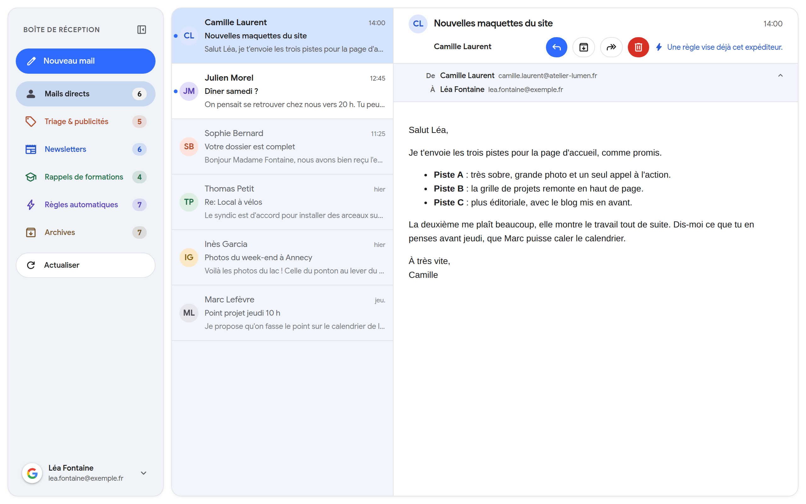
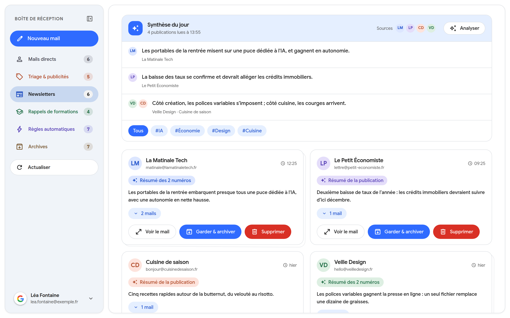
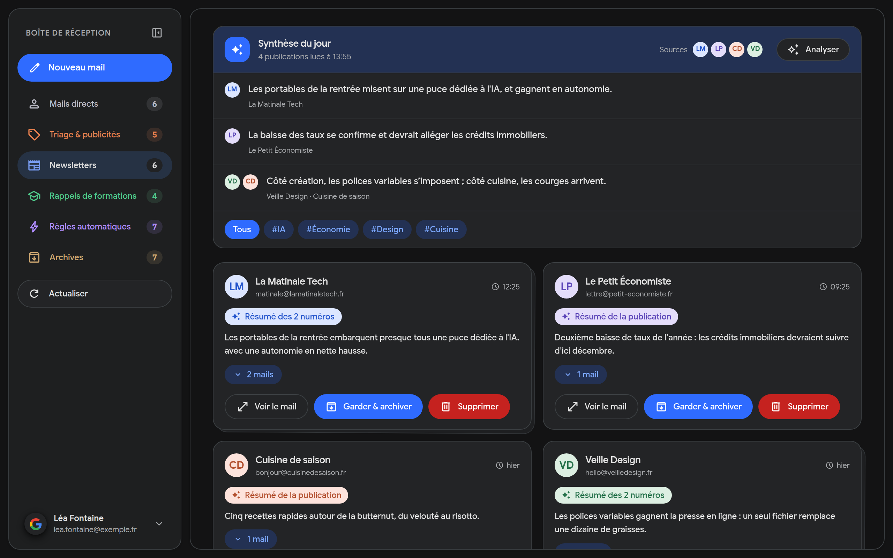
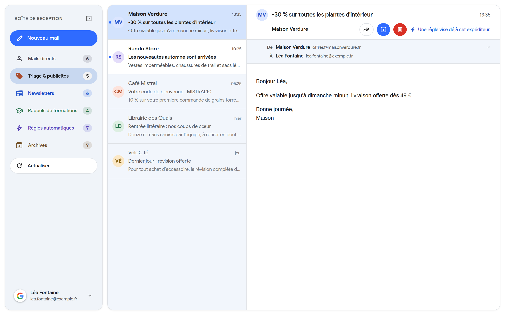
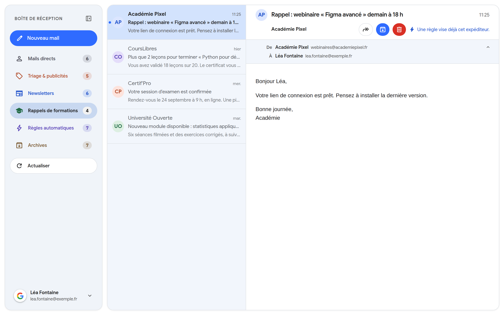
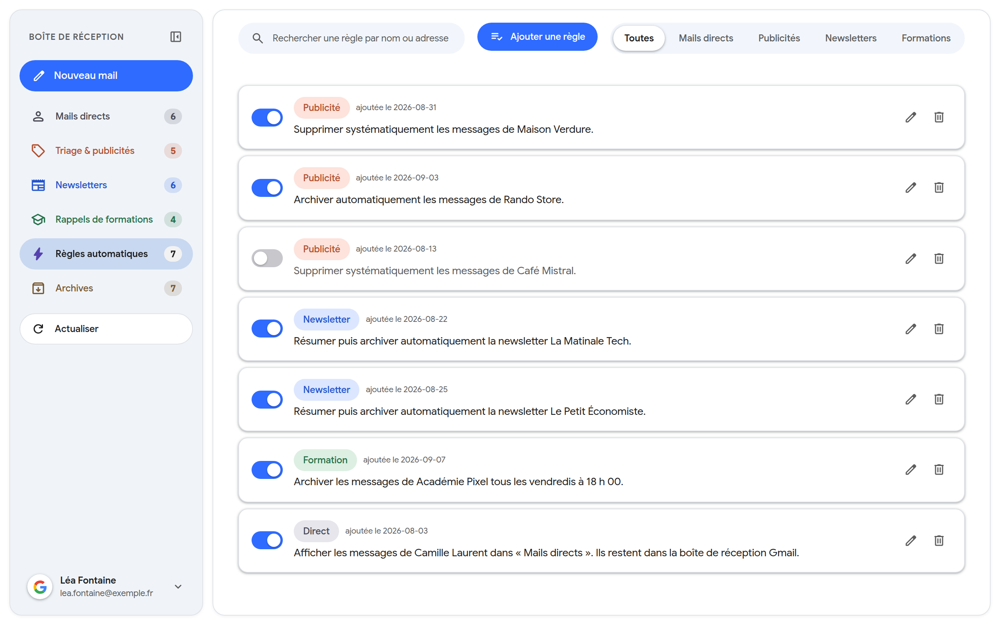
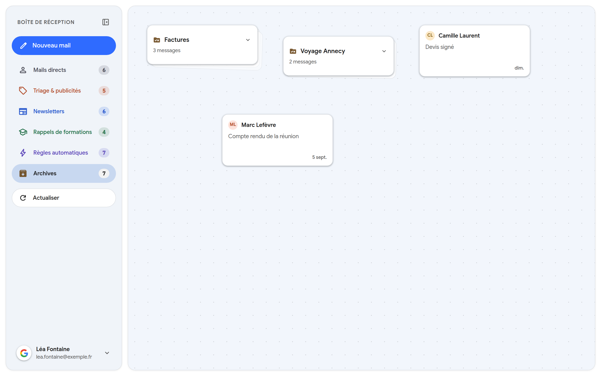
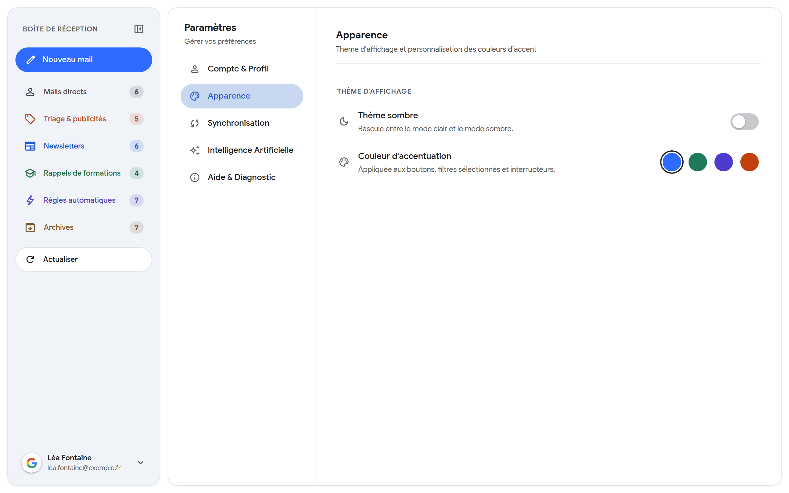
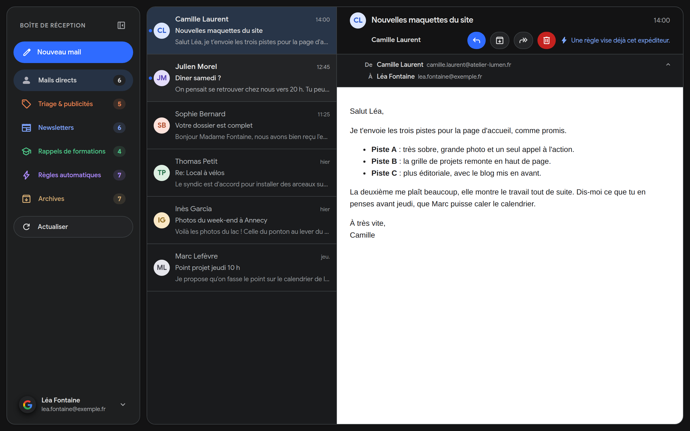

<p align="center">
  
</p>

<h1 align="center">MailFlow</h1>

<p align="center">
  Le client mail de bureau qui trie votre boîte Gmail à votre place.<br>
  Les vrais messages d'un côté, les publicités nettoyées, les newsletters résumées.<br>
  Fonctionne sur Linux, macOS et Windows.
</p>

<p align="center">
  <a href="https://github.com/TISEPSE/MailFlow/releases/latest"></a>
  <a href="https://github.com/TISEPSE/MailFlow/actions/workflows/ci.yml"></a>
  <a href="LICENSE"></a>
</p>

## Captures d'écran

<p align="center">
  
</p>

Les newsletters regroupées par publication et résumées, en thème clair ou sombre :

<p align="center">
  
  
</p>

| | |
|:---:|:---:|
|  |  |
| Triage & publicités | Rappels de formations |
|  |  |
| Règles automatiques | Table des archives |
|  |  |
| Paramètres | Mails directs, thème sombre |

Les captures montrent une boîte fictive : voir [le mode démo](#mode-démo).

## Télécharger

Prenez la dernière version pour votre système sur la
[page des releases](https://github.com/TISEPSE/MailFlow/releases/latest).

| Système | Formats |
|---------|---------|
| Linux | `.deb`, `.AppImage` |
| macOS | `.dmg` (Apple Silicon et Intel) |
| Windows | `.exe` |

Sur macOS, l'application n'est pas encore signée : au premier lancement, il faut
l'autoriser dans *Réglages Système > Confidentialité et sécurité*. Le détail est
dans [`docs/publier-une-version.md`](docs/publier-une-version.md#le-cas-de-macos).

## Fonctionnalités

- **Mails directs** : seuls les messages écrits par de vraies personnes, avec la
  lecture à côté de la liste
- **Triage des publicités** : archiver, supprimer, ou créer une règle qui s'en
  chargera la prochaine fois
- **Newsletters** regroupées par publication, résumées par IA, avec une synthèse
  du jour et un filtre par thème
- **Rappels de formations** : webinaires, cours en ligne et examens au même
  endroit
- **Règles automatiques** sans une ligne de code : les activer, les couper, les
  programmer (tous les vendredis à 18 h, par exemple)
- **Table des archives** : les messages se rangent en tas, et chaque tas devient
  un libellé Gmail
- Plusieurs comptes Gmail, et une vue qui les réunit
- Recherche au clavier avec `Ctrl+K`
- Thème clair ou sombre, couleur d'accentuation au choix

Côté vie privée : les jetons de connexion restent dans le trousseau du système,
le contenu des messages s'affiche dans un cadre isolé, et seules les newsletters
sont envoyées au modèle de langage. Les mails de vos proches ne quittent jamais
votre machine.

## Développement

MailFlow est construit avec Tauri 2 (Rust + React + TypeScript).

### Prérequis

- Node.js 24 ou plus
- Rust 1.88 ou plus
- Sur Linux :

  ```bash
  sudo apt install libwebkit2gtk-4.1-dev libgtk-3-dev \
    libayatana-appindicator3-dev librsvg2-dev libsoup-3.0-dev \
    build-essential pkg-config
  ```

- Un agent de trousseau actif (GNOME Keyring, KWallet). Sans lui, MailFlow ne
  peut pas garder la connexion Gmail ; l'écran de diagnostic le signale.

### Démarrer

```bash
git clone https://github.com/TISEPSE/MailFlow.git
cd MailFlow
npm install
cp .env.example .env     # renseigner MAILFLOW_GOOGLE_CLIENT_ID
npm run tauri:dev
```

L'identifiant client se crée chez Google : voir
[`docs/connexion-google.md`](docs/connexion-google.md).

### Mode démo

```bash
npm run demo             # http://localhost:1421
```

L'interface tourne dans le navigateur avec une boîte inventée, sans compte
Google ni backend Rust. C'est elle qui sert aux captures d'écran :
`npm run captures` les refait toutes dans `docs/captures/` (Google Chrome doit
être installé).

### Commandes utiles

```bash
npm run tauri:dev        # lancer l'application
npm run lint             # oxlint
npm test                 # tests de l'interface (vitest)
npm run build            # types + bundle frontend
npm run tauri:build      # construire les paquets

cd src-tauri
cargo fmt --all --check
cargo clippy --all-targets -- -D warnings
cargo test               # tests du backend
```

## Documentation

- [Architecture](docs/architecture.md) : qui détient quoi, entre Rust et React
- [Connexion Google](docs/connexion-google.md) : créer l'identifiant client OAuth
- [Publier une version](docs/publier-une-version.md) : builds, release, macOS,
  site public
- [Cahier des charges](docs/cahier-des-charges.md) et [décisions de
  conception](docs/specs/)

## Licence

MIT, voir [`LICENSE`](LICENSE). Le nom « MailFlow » et le logo ne sont pas
couverts par cette licence : ils identifient l'application d'origine.
